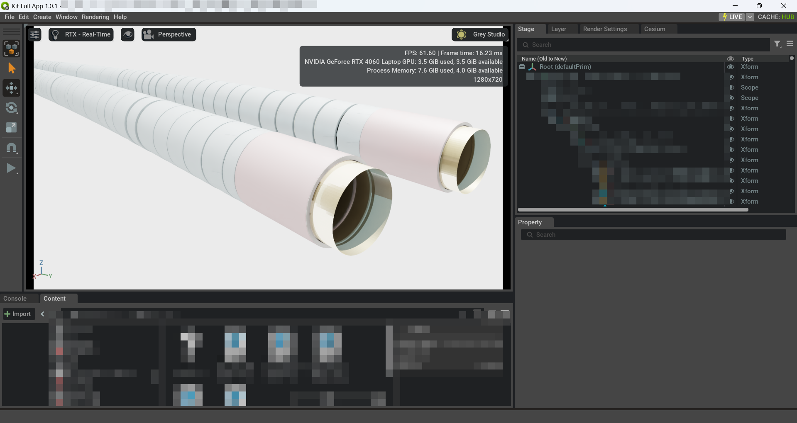
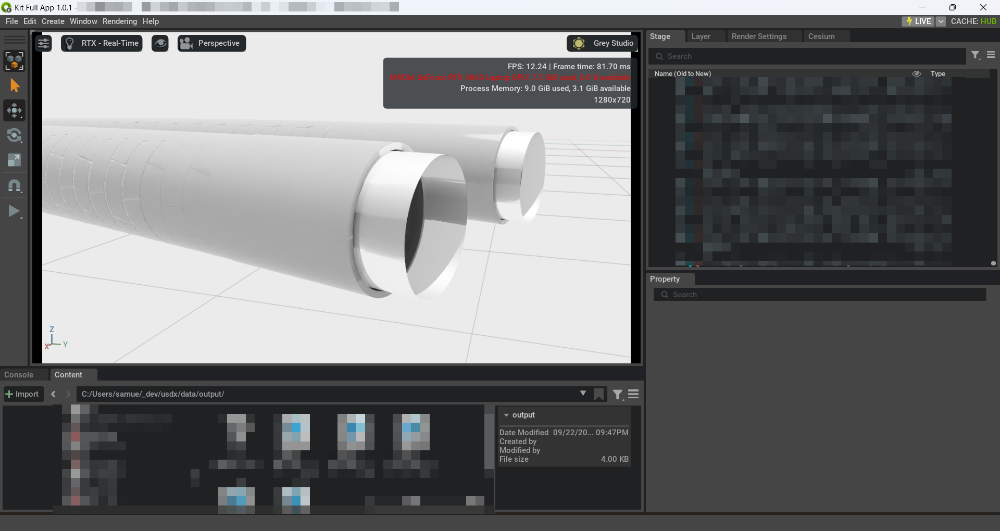

IFC → USD Converter (Federated)

Overview
- Converts IFC files to USD with prototypes, materials, and instances.
- Adds WGS84 geolocation attributes to /World.
- Builds a federated master stage (Federated Model.usda) that payloads each per-file stage under /World/<discipline>.
- Authors IFC properties/quantities as USD attributes under BIMData namespace.

Requirements
- Python >= 3.11
- Packages (see pyproject.toml):
  - openusd core wheel (pxr) via usd-core
  - ifcopenshell==0.8.3.post2
  - pyproj==3.7.2 (for CRS transforms)
  - omniverse-kit (for omni.client omniverse:// support)
  - numpy, etc.

Environment
- Windows requires the Microsoft Visual C++ 2015–2022 Redistributable x64.
- Ensure your virtual environment is active before running.

Install
- Create/activate venv and install dependencies per your workflow (e.g., pip install -e . or use uv per uv.lock).

Usage (CLI)
- Single IFC file:
  - python -m ifc_converter --input C:\\path\\to\\file.ifc
- Directory, specific names:
  - python -m ifc_converter --input C:\\path\\to\\dir --ifc-names A.ifc B.ifc
- Directory, all files:
  - python -m ifc_converter --input C:\\path\\to\\dir --all
- Directory, all files excluding drafts:
  - python -m ifc_converter --input C:\\path\\to\\dir --all --exclude DraftModel TempIFC
- Custom CRS (default EPSG:7855):
  - python -m ifc_converter --input C:\\path\\to\\dir --all --map-coordinate-system EPSG:XXXX
- Manifest-driven base points / federated routing:
  - python -m ifc_converter --input C:\\path\\to\\dir --all --manifest src/ifc_converter/config/sample_manifest.json
- Nucleus (omniverse://) paths work for files or directories:
  - python -m ifc_converter --input omniverse://server/Projects/IFC --all

Usage (VS Code)
- Press F5 and pick one of the provided launch configurations in .vscode/launch.json.
- Modify args there to suit your inputs.

Usage (Python)
- from ifc_converter import convert
- results = convert("path/to/file.ifc", output_dir="data/output")  # returns List[ConversionResult]
- convert("omniverse://server/Projects/file.ifc", output_dir="omniverse://server/USD/output")

Outputs
- Per-IFC stages and layers are written to data/output:
  - <name>.usda (stage)
  - prototypes/<name>_prototypes.usda
  - materials/<name>_materials.usda
  - instances/<name>_instances.usda
  - annotations/<name>_annotations.usda (when present)
    - /World/<file>_Instances preserves the IFC spatial hierarchy (Project/Site/Storey/Class).
    - Optional grouping variants (see src/ifc_converter/process_usd.py:author_instance_grouping_variant) can reorganize instances on demand without losing the canonical hierarchy.
  - caches/<name>.json stores serialized instance metadata for later regrouping sessions.
- Federated master stage:
  - Federated Model.usda: contains a /World default prim.
  - Each IFC adds a child prim /World/<name> with an inactive payload to that file’s default prim.

Units and Geospatial
- Per-file stages author metersPerUnit as needed; WGS84 (lon/lat/height) are authored on /World as Double attributes:
  - cesium:georeferenceOrigin:longitude, cesium:georeferenceOrigin:latitude, cesium:georeferenceOrigin:height
- Federated Model.usda is authored with metersPerUnit=1.0 (meters). Payloads are not rescaled; a log line indicates alignment or mismatch.

IFC Metadata as USD Attributes
- IFC psets/qtos are authored as attributes (not customData) using:
  - BIMData:Psets:<PsetName>:<PropName>
  - BIMData:QTO:<QtoName>:<PropName>
- Types are inferred (Bool/Int/Double and arrays; fallback String).

Federated Stage Behavior
- Each converted USD stage is added as a payload under /World/<file_stem> in Federated Model.usda.
- Payload prims are authored inactive (unloaded by default). Activate to load content.
- Targets the payload stage’s default prim to avoid /World nesting when possible.

Programmatic Use
- main(argv=None) and parse_args(argv=None) accept a list of tokens to drive from scripts/notebooks.
Manifest Schema
- defaults: Global fallback for master name, projected/geodetic CRS, and base point.
- masters: Named federated stages with optional CRS/base point overrides.
- files: Match rules (name or glob pattern) that choose a master and override CRS/base point or provide lon/lat.

Notes
- JSON manifests work immediately; YAML manifests require installing PyYAML.
- A sample manifest template lives at src/ifc_converter/config/sample_manifest.json; copy or rename it locally (e.g. to src/ifc_converter/config/manifest.yaml) when preparing project-specific settings. The real manifest remains untracked by design and can be loaded from local paths or omniverse:// URIs.
- 2D annotation contexts (e.g. alignment strings in IfcAnnotation) are skipped; the converter logs a warning and continues without them.

Troubleshooting
- pxr ImportError with _tf/_usd DLLs on Windows: install latest VC++ redistributable x64.
- CRS conversions require pyproj; if missing, WGS84 attributes won’t be authored.

Examples
- NVIDIA CAD Converter export of the same tunnel segment shows gaps and lost detail when tessellating the IFC input.

- Our IFC pipeline preserves full segment detail and materials while authoring clean instance hierarchies.

