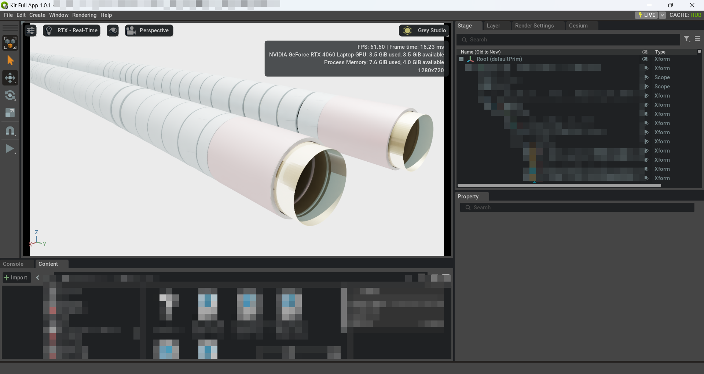
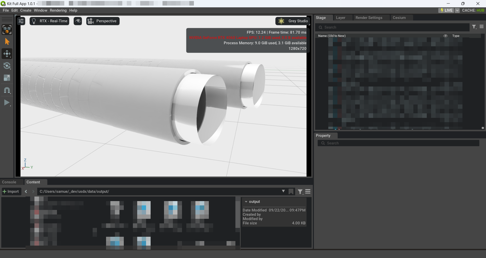

# BuildUSD: IFC to USD Converter (Federated)

Overview
- Converts IFC files to USD with prototypes, materials, and instances.
- Optionally adds WGS84 geolocation attributes to /World (when anchoring or lon/lat overrides are supplied and geospatial mode is enabled).
- Provides a separate federation CLI (`python -m buildusd.federate`) that assembles per-file stages into project master files without touching conversion outputs.
- Authors IFC properties/quantities as USD attributes under a BIMData namespace.

Requirements
- Python >= 3.11, < 3.13
- Shared dependencies (see `pyproject.toml`):
  - `ifcopenshell>=0.8.3.post2,<0.9`
  - `pyproj>=3.7` (for CRS transforms)
  - `numpy`, `polars`, `PyYAML`, `shapely`, `webcolors`
- **Kit mode (default)** - Python 3.12 only for the current Omniverse Kit wheels. No standalone `usd-core` wheel is required. Install Omniverse Kit (`pip install --extra-index-url https://pypi.nvidia.com "buildusd[kit]"`) so `omni.client` and Kit's pxr are available.
- **Offline mode (`--offline`)** - install a standalone USD build (`pip install "buildusd[offline]"`). All paths must be local; `omniverse://` URIs are rejected and checkpointing is skipped.

Support matrix (tested)
- OS: Windows 10/11, Ubuntu 22.04 (headless OK).
- Python: 3.11, 3.12.
- Kit mode: Python 3.12 only, due to current `omniverse-kit` wheel metadata.
- IfcOpenShell: 0.8.3.post2.
- USD bindings: Omniverse Kit pxr, usd-core 25.8.
- pythonocc: optional; OCC detail requires an OCC-enabled ifcopenshell build.

Environment
- Windows requires the Microsoft Visual C++ 2015–2022 Redistributable x64.
- Ensure your virtual environment is active before running.

Quick start (offline)
- Download a small public IFC (e.g., Duplex_A_20110907.ifc from common samples) into `data/input/`.
- Convert locally (no Kit):
  `python -m buildusd --offline --input data/input/Duplex_A_20110907.ifc`
- Expected: stages and layers under `data/output/Duplex_A_20110907/`; no Nucleus access.
- Additional IFC samples are available at https://github.com/youshengCode/IfcSampleFiles (see that repository’s license; attribute and comply with its terms when using those files).

Quick start (Nucleus / Kit)
- Accept Kit EULA, install Kit, and ensure an `omniverse://` endpoint is reachable.
- Convert and checkpoint:
  `python -m buildusd --input omniverse://server/Projects/IFC/Duplex_A.ifc --checkpoint`
- Expected: authored layers on Nucleus; headless Kit session auto-starts.

Quick start (Autodesk Forma / ACC)
- This initial integration is read-only. It resolves an immutable Autodesk Data Management file version, downloads hosted IFC directly, or asks APS Model Derivative to translate a hosted RVT version to IFC. The local IFC then enters the normal BuildUSD pipeline.
- Provision the APS application in the relevant Forma hub. Configure either `APS_ACCESS_TOKEN` (for an existing access token) or both `APS_CLIENT_ID` and `APS_CLIENT_SECRET`; credentials are intentionally not accepted as CLI arguments.
- Convert a hosted version:
  `python -m buildusd --offline --forma-project-id "b.PROJECT_ID" --forma-version-id "urn:adsk.wipprod:fs.file:vf.VERSION?version=1"`
- Browse an entire project interactively from an ACC Docs URL:
  `python -m buildusd --offline --forma-project-url "https://acc.autodesk.com/docs/files/projects/PROJECT_ID" --forma-browse --output data/output`
- Supply a base folder with `--base-url` (an alias of `--forma-project-url`) using an ACC URL containing `folderUrn`, or combine `--forma-project-id` with `--forma-folder-id "urn:adsk.wipprod:fs.folder:co..."`.
- For a base folder URL, discovery reads only that folder by default. Add `--subfolder` for unlimited descendant traversal, or `--depth N` to cap traversal (`--depth 0` is the base folder only; `--depth 1` includes immediate child folders). `--depth` implies subfolder traversal.
- Project browsing prints discovered RVT/IFC paths and ACC links, then accepts a numbered selection such as `1,3-5`. Use `--all` to convert every discovered model or repeat `--forma-file "Folder/*.rvt"` for non-interactive filtering.
- A pasted ACC file URL containing `entityId` can be converted directly without supplying a version URN; BuildUSD resolves and pins the item's current tip version before acquisition.
- Acquired IFC files are content-cached by project, immutable version, and IFC export setting. Override the cache with `--forma-cache-dir` or `BUILDUSD_FORMA_CACHE_DIR`.
- RVT defaults to the `IFC4 Reference View` export setting. Use `--forma-ifc-export-setting`, `--forma-force-translation`, and the Forma timeout/polling options when required.
- This slice does not yet browse hubs/projects, subscribe to version events, or upload generated USD artifacts back to Autodesk.

Install
- Create/activate venv and install dependencies per your workflow (e.g., `pip install -e ".[offline]"` for local USD use, `pip install -e ".[dev]"` for development, or `uv sync` if you use uv).
- **Kit mode**
  - Accept the Kit EULA once (PowerShell ``set OMNI_KIT_ACCEPT_EULA=yes``, bash ``export OMNI_KIT_ACCEPT_EULA=yes``).
  - Install Kit: `pip install --extra-index-url https://pypi.nvidia.com -e ".[kit]"`.
  - Optional: ``python -c "from omni.kit_app import KitApp; KitApp().shutdown(); print('Omniverse ready')"`` to verify the runtime.
  - The converter auto-starts a headless Kit session whenever an `omniverse://` path is encountered.
- **Offline mode**
  - Install `usd-core` (or another pxr build) alongside ifcopenshell via `pip install -e ".[offline]"`.
- **Optional USD validation**
  - Install NVIDIA OpenUSD Exchange validation tooling with `pip install -e ".[usd-validation]"`.
  - Run validator tests with `python -m pytest -m usd_validation --basetemp .pytest_tmp_usd_validation`.
  - This is currently a test-only quality gate for generated USD assets, not a runtime conversion dependency.
- Run ``python -m buildusd ...`` from the repo root, or ``pip install -e .`` for a global CLI.
- Legacy invocations like ``python -m ifc_converter`` continue to work via a compatibility shim.
- INFO logs show which directory or Nucleus path is scanned and each IFC file as it starts processing (`PYTHONUNBUFFERED=1` for unbuffered output).

Mode selection & environment variables
- The converter can author USD via two bindings:
  - **Kit mode** (default). Used whenever any supplied path is `omniverse://` _or_ when `BUILDUSD_DEFAULT_USD_MODE` (legacy `IFC_CONVERTER_DEFAULT_USD_MODE`) resolves to `kit`. Requires Omniverse Kit (`omni.client`), automatically boots Kit in headless mode, and enables Nucleus features such as checkpoints.
  - **Offline mode**. Activated by providing `--offline` on the CLI, `offline=True` in the Python API, or setting `BUILDUSD_DEFAULT_USD_MODE=offline` (legacy `IFC_CONVERTER_DEFAULT_USD_MODE=offline`). All paths must be local filesystem locations. Nucleus checkpoint requests are ignored and `omniverse://` inputs raise a `ValueError`.
- Mode-precedence rules:
  1. Explicit CLI/programmatic `offline=True` wins.
  2. Otherwise, if any input/output/manifest path starts with `omniverse://`, Kit mode is chosen.
  3. Otherwise, the environment variable `BUILDUSD_DEFAULT_USD_MODE` (`kit` by default, falls back to `IFC_CONVERTER_DEFAULT_USD_MODE`) decides the binding.
- Exclusion handling honours the mode: `--exclude` takes bare stems or names with `.ifc` and skips them case-insensitively during directory scans (local paths or Nucleus directories).
- Relevant environment variables:
  - `BUILDUSD_DEFAULT_USD_MODE` / `IFC_CONVERTER_DEFAULT_USD_MODE` - `kit` (default) or `offline`; establishes the initial USD binding when the process starts.
  - `OMNI_KIT_ACCEPT_EULA` – set to `yes` to suppress Kit's interactive EULA prompt during headless launches.
  - `PYTHONUNBUFFERED` – optional; keep at `1` to stream logs without buffering during long conversions.
  - `USD_FORCE_MODULE_NAME` – honoured by pxr when present; useful if your USD distribution installs under a different module alias.
  - `APS_ACCESS_TOKEN` – existing Autodesk Platform Services access token for Forma/ACC acquisition. RVT translation requires `data:read`, `data:write`, and `bucket:read` scopes.
  - `APS_CLIENT_ID` / `APS_CLIENT_SECRET` – OAuth client credentials for a provisioned APS server application.
  - `BUILDUSD_FORMA_CACHE_DIR` – optional local cache root for Forma/ACC source materialization.

Usage (CLI)
- Single IFC file:
  - python -m buildusd --input C:\\path\\to\\file.ifc
- Directory, specific names:
  - python -m buildusd --input C:\\path\\to\\dir --ifc-names A.ifc B.ifc
- Directory, all files:
  - python -m buildusd --input C:\\path\\to\\dir --all
- Offline conversion (local-only, no Kit):
  - python -m buildusd --offline --input C:\\path\\to\\dir --all
- Directory, all files excluding drafts:
  - python -m buildusd --input C:\\path\\to\\dir --all --exclude DraftModel TempIFC
- Checkpoint authored layers on Nucleus:
  - python -m buildusd --input omniverse://server/Projects/IFC --all --checkpoint
- Custom CRS (default EPSG:7855):
  - python -m buildusd --input C:\\path\\to\\dir --all --map-coordinate-system EPSG:XXXX
- Manifest-driven base points / federated routing:
  - python -m buildusd --input C:\\path\\to\\dir --all --manifest src/buildusd/config/sample_manifest.json
  - python -m buildusd --input C:\\path\\to\\dir --all --manifest src/buildusd/config/sample_manifest.yaml
- Assemble masters after conversion:
  - python -m buildusd.federate --stage-root data/output --manifest src/buildusd/config/sample_manifest.json
  - python -m buildusd.federate --stage-root data/output --manifest src/buildusd/config/sample_manifest.yaml --masters-root data/federated --rebuild
  - python -m buildusd --input C:\\path\\to\\dir --all --manifest src/buildusd/config/sample_manifest.yaml --federate
  - python -m buildusd --input C:\\path\\to\\dir --all --federate --federate-into data/federated/ProjectMaster.usdc
  - python -m buildusd.federate --stage-root data/output --stage A.usdc B.usdc --federate-into data/federated/ProjectMaster.usdc
- Federation CLI options (`python -m buildusd.federate`):
  - `--stage-root`, `--stage`, `--masters-root`, `--manifest`, `--federate-into`, `--parent-prim`, `--map-coordinate-system`, `--anchor-mode`, `--frame`, `--unanchored`, `--offline`, `--rebuild`
- Nucleus (omniverse://) paths work for files or directories:
  - python -m buildusd --input omniverse://server/Projects/IFC --all
- Autodesk Forma/ACC immutable file version:
  - python -m buildusd --offline --forma-project-id b.PROJECT_ID --forma-version-id "urn:adsk.wipprod:fs.file:vf.VERSION?version=1"
- Browse and select Autodesk Forma/ACC project models:
  - python -m buildusd --offline --forma-project-url "https://acc.autodesk.com/docs/files/projects/PROJECT_ID" --forma-browse --output D:\BuildUSD_Output
  - python -m buildusd --offline --base-url "https://acc.autodesk.com/docs/files/projects/PROJECT_ID?folderUrn=FOLDER_URN" --subfolder --depth 1 --all --output D:\BuildUSD_Output
  - python -m buildusd --offline --forma-project-id b.PROJECT_ID --forma-file "Project Files/Architecture/*.rvt" --forma-file "Project Files/Civil/*.ifc" --output D:\BuildUSD_Output
- Detail routing examples:
  - python -m buildusd --detail-mode --detail-engine default   # IFC subcomponents first, OCC fallback for all products
  - python -m buildusd --detail-mode --detail-engine occ       # OCC only for all products (skip subcomponents)
  - python -m buildusd --detail-mode --detail-engine semantic  # IFC subcomponents only (no OCC fallback) for all products
  - python -m buildusd --detail-mode --detail-scope object --detail-objects 1265 ubd7n32hksiop  # detail only specific STEP ids / GUIDs
  - python -m buildusd --detail-mode --detail-engine occ --detail-scope object --detail-objects 1265  # OCC-only detail for targeted objects
  - PowerShell note: GUIDs with `$` must be quoted or escaped, e.g. `--detail-objects '0jNViHeUb9$QjXG30GXDQy'` or ``--detail-objects 0jNViHeUb9`$QjXG30GXDQy``.
- CLI detail flags (defaults/behavior):
  - `--detail-mode`: off by default; enables the detail pipeline.
  - `--detail-scope`: optional; defaults to `all` when omitted. Use `object` with `--detail-objects`.
  - `--detail-objects`: space-separated STEP ids and/or GUIDs; implies `--detail-mode` and `--detail-scope object` when supplied.
  - `--detail-engine`: `default` (semantic first, OCC fallback), `occ|opencascade` (OCC only), `semantic|ifc-subcomponents|ifc-parts` (semantic only). If OCC is unavailable, the engine falls back to semantic with a warning.
  - Shell quoting: in PowerShell, `$` expands variables; wrap GUIDs in single quotes or escape `$` with a backtick.
- File-backed targeted detail worker:
  - python -m buildusd.worker --jobs ./jobs --limit 1
  - buildusd-worker --jobs ./jobs --results ./jobs/results --limit 4
  - The worker reads generic `buildusd.job.v1` JSON files from `./jobs/pending` when that folder exists, otherwise from `./jobs`, runs object-scope detail conversion outside any host application, writes `*.result.json`, and archives jobs into `completed` or `failed`.
- Update meters-per-unit metadata on an existing USD stage/layer (no IFC conversion):
  - python -m buildusd --set-stage-unit "omniverse://server/Projects/file.usdc" --stage-unit-value 0.001
- Update up-axis metadata on an existing USD stage/layer (no IFC conversion):
  - python -m buildusd --set-stage-up-axis "omniverse://server/Projects/file.usdc" --stage-up-axis Z
- 2D annotation extraction (off by default):
  - python -m buildusd --input C:\\path\\to\\dir --include-2d
- Annotation curve widths (use with --include-2d):
  - python -m buildusd --input C:\\path\\to\\dir --include-2d --annotation-width-default 15mm
  - python -m buildusd --input C:\\path\\to\\dir --include-2d --annotation-width-rule width=0.02,layer=Survey*,curve=*Centerline*
  - python -m buildusd --input C:\\path\\to\\dir --include-2d --annotation-width-config src/buildusd/config/sample_annotation_widths.json
  - python -m buildusd --input C:\\path\\to\\dir --include-2d --annotation-width-config src/buildusd/config/sample_annotation_widths.yaml

CLI call signatures
```bash
python -m buildusd [--input PATH] [--output PATH] [options]
python -m buildusd.federate --stage-root PATH --manifest MANIFEST [options]
```

CLI options (summary)
- Input/output: `--input`, `--output`, `--ifc-names`, `--exclude`, `--all`, `--manifest`, `--base-url`, `--forma-project-id`, `--forma-project-url`, `--forma-folder-id`, `--subfolder`, `--depth`, `--forma-version-id`, `--forma-browse`, `--forma-file`, `--forma-cache-dir`
- Execution: `--offline`, `--checkpoint`, `--usd-format`, `--usd-auto-binary-threshold-mb`, `--map-coordinate-system`, `--geospatial-mode`
- 2D: `--include-2d`, `--annotation-width-default`, `--annotation-width-rule`, `--annotation-width-config`
- Anchoring/federation: `--anchor-mode`, `--federate`, `--federate-into`, `--frame`, `--unanchored` (federation only)
- Detail: `--detail-mode`, `--detail-scope`, `--detail-objects`, `--detail-engine`, `--enable-semantic-subcomponents`, `--semantic-tokens`
- Worker: `python -m buildusd.worker --jobs PATH [--results PATH] [--limit N]`
- Utilities: `--set-stage-unit`, `--stage-unit-value`, `--set-stage-up-axis`, `--stage-up-axis`

CLI reference (full)
```text
python -m buildusd
  --map-coordinate-system, --map-epsg   EPSG code or CRS string for map eastings/northings
  --input PATH                          IFC file or directory (default: repo root)
  --forma-project-id ID                Autodesk Forma/ACC Data Management project ID
  --forma-project-url, --base-url URL  Base ACC project, folder, or file URL
  --forma-folder-id ID                 Set the base folder by its ACC folder URN
  --subfolder                          Include descendants of the base folder
  --depth N                            Maximum depth below the base folder
  --forma-version-id ID                Immutable Autodesk Forma/ACC file version ID
  --forma-browse                       Recursively list project RVT/IFC files and prompt for a selection
  --forma-file GLOB                    Select discovered project-relative files (repeatable)
  --forma-cache-dir PATH               Local cache for acquired Forma IFC files
  --forma-ifc-export-setting NAME      RVT-to-IFC export setting
  --forma-force-translation            Regenerate the RVT-to-IFC derivative
  --forma-translation-timeout-seconds FLOAT
                                       Maximum wait for RVT translation
  --forma-poll-interval-seconds FLOAT  RVT translation polling interval
  --output PATH                         Output directory for USD artifacts
  --manifest PATH                       Manifest (YAML/JSON) for base points and masters
  --ifc-names NAMES...                  Specific IFC files to process in a directory
  --exclude NAMES...                    IFC file names to skip
  --all                                 Process every eligible local file or discovered ACC model
  --checkpoint                          Create Nucleus checkpoints (omniverse:// only)
  --offline                             Force standalone USD (no Kit); local paths only
  --set-stage-unit PATH                 Update metersPerUnit on an existing layer/stage
  --stage-unit-value FLOAT              metersPerUnit value for --set-stage-unit
  --set-stage-up-axis PATH              Update upAxis on an existing layer/stage
  --stage-up-axis {X|Y|Z}               upAxis value for --set-stage-up-axis
  --annotation-width-default VALUE      Default annotation width (e.g. 15mm)
  --annotation-width-rule SPEC          Width override rule (repeatable)
  --annotation-width-config PATH        Width config file (repeatable)
  --include-2d                          Enable 2D annotation extraction
  --anchor-mode {local|basepoint|none}  Anchor mode for model offsets
  --federate                            Run federation after conversion
  --federate-into PATH                  Explicit target stage for append-only federation
  --frame {projected|geodetic}          Federation frame (used with --federate)
  --unanchored {skip|same-origin}
                                          Skip unanchored payloads, or place them at zero offset when all payloads share one local origin
  --geospatial-mode {auto|usd|omni|none} Geospatial metadata mode
  --usd-format {usdc|usda|usd|auto}     Output USD format
  --usd-auto-binary-threshold-mb FLOAT  Re-export as usdc above this size (MB)
  --detail-mode                         Enable detail pipeline
  --detail-scope {all|object}           Scope for detail meshes (default: all)
  --detail-objects STEP_OR_GUID...      Targets for object-scoped detail
  --detail-engine {default|occ|opencascade|semantic|ifc-subcomponents|ifc-parts}
                                       Detail engine routing
  --enable-semantic-subcomponents       Enable semantic subcomponent splitting
  --semantic-tokens PATH                JSON file of semantic tokens
```

```text
python -m buildusd.federate
  --stage-root PATH                     Root directory containing converted stages
  --stage PATHS...                      Specific stage files to federate
  --masters-root PATH                   Output directory for federated masters
  --manifest PATH                       Manifest describing federation targets (optional when --federate-into is set)
  --federate-into PATH                  Explicit target stage for append-only federation
  --parent-prim PATH                    Parent prim for payloads (default: /World)
  --map-coordinate-system EPSG          Fallback CRS when manifest omits projected_crs
  --anchor-mode {local|basepoint|none}  Match anchoring used by converted stages
  --frame {projected|geodetic}          Federation frame for delta computation
  --unanchored {skip|same-origin}
                                          Skip unanchored payloads, or place them at zero offset when all payloads share one local origin
  --offline                             Standalone USD mode (no Kit)
  --rebuild                             Rebuild masters from scratch
```

Model offsets & anchoring
- Stages stay in meters (metersPerUnit=1.0).
- Iterator tessellation runs with use-world-coords=False; placements come from the iterator transform.
- Per file we resolve a model offset when --anchor-mode is set:
  - local -> IfcSite.ObjectPlacement (meters)
  - basepoint -> Project Base Point (PBP) if available, else Survey Point (SP), else (0,0,0) with a warning
  - none -> no model-offset (geospatial metadata only if a lon/lat override is supplied)
- Offsets are baked into geometry via ifcopenshell model-offset; no USD XformOps are authored for anchoring.
- The GeometrySettingsManager applies offset-type (default negative) to the raw offset and pushes the signed value into all ifcopenshell settings objects.
- MapConversion grid rotation (when applicable) is applied via ifcopenshell model-rotation (quaternion), not USD XformOps.
- Each IFC file gets its own resolved offset; offsets are not shared across files.

Usage (debugging)
- Run the CLI examples above from an activated environment, or create local editor launch settings with the same arguments. Editor-specific launch files are intentionally not required by the repo.

Usage (Python)
- from buildusd import convert
- results = convert("path/to/file.ifc", output_dir="data/output")  # returns List[ConversionResult]
- convert("omniverse://server/Projects/file.ifc", output_dir="omniverse://server/USD/output")
- convert("path/to/file.ifc", output_dir="data/output", checkpoint=True)  # omniverse:// required for checkpoints
- from buildusd import ConversionOptions
- convert("path/to/file.ifc", output_dir="data/output", options=ConversionOptions(include_2d=True))
- from buildusd.api import set_stage_unit
- set_stage_unit("omniverse://server/Projects/file.usdc", meters_per_unit=0.001)
- from buildusd.api import set_stage_up_axis
- set_stage_up_axis("omniverse://server/Projects/file.usdc", axis="Z")

ConversionOptions examples (programmatic)
- Detail all with OCC fallback after subcomponents:
  - `options = ConversionOptions(detail_mode=True, detail_scope="all", detail_engine="default")`
- Detail specific objects (mixed ids/guids) via OCC only:
  - `options = ConversionOptions(detail_mode=True, detail_scope="object", detail_objects=(1265, "UBD7N32HKSiop"), detail_engine="occ")`
- Semantic-only detail (no OCC fallback):
  - `options = ConversionOptions(detail_mode=True, detail_scope="all", detail_engine="semantic")`
- Geometry overrides (safe subset only):
  - `options = ConversionOptions(detail_mode=True, detail_scope="all", geom_overrides={"mesher-linear-deflection": 0.5, "mesher-angular-deflection": 5})`
- Include 2D annotation extraction (default is off):
  - `options = ConversionOptions(include_2d=True)`

Manifest schema
- Sample manifests live in `src/buildusd/config/sample_manifest.{json,yaml}`. Keep the same structure (masters, base points, CRS). Add a JSON Schema alongside your manifests if you want automated validation (e.g., `manifest.schema.json`).

Outputs
- Per-IFC stages and layers are written to data/output:
  - <name>.usda (stage)
  - prototypes/<name>_prototypes.usda
  - materials/<name>_materials.usda
  - instances/<name>_instances.usda
  - geometry2d/<name>_geometry2d.usda (when present; captured 2D alignment/annotation curves; requires --include-2d or include_2d=True)
    - /World/<file>_Instances preserves the IFC spatial hierarchy (Project/Site/Storey/Class).
    - Optional grouping variants (see src/buildusd/process_usd.py:author_instance_grouping_variant) can reorganize instances on demand without losing the canonical hierarchy.
  - caches/<name>.json stores serialized instance metadata for later regrouping sessions.
  - graphs/<name>.semantic_graph.json stores a semantic graph sidecar with IFC/USD identity links, source material evidence, decomposition quality, logical composite parts, and targeted enrichment requests for objects that need part-level geometry.
- Optional federated masters (run `python -m buildusd.federate --manifest ...` after conversion):
  - Creates master stage(s) defined in the manifest without overwriting per-file outputs.
  - Each converted stage is referenced beneath `/World/<safe_name>` so you can compose projects on demand.

Materials
- IFC render precedence respected: geometry `IfcStyledItem` styles first, then material presentation (`IfcMaterialDefinitionRepresentation`), then shape aspects, then type. When no MDR is present, we also try `ifcopenshell.util.representation.get_material_style` for the associated material.
- `IfcSurfaceStyleRendering` maps to PreviewSurface: baseColor from SurfaceColour (else DiffuseColour), opacity from Transparency, roughness from SpecularRoughness/specular level, metallic from ReflectanceMethod, emissive from EmissiveColour/SelfLuminous. SurfaceStyleWithTextures/ImageTexture set the baseColor texture when present; UVs from IfcIndexedPolygonalTextureMap are authored as `primvars:st`.
- Names drop literal “Undefined” and add a closest CSS color hint when available (`webcolors` preferred; small fallback palette otherwise).
- Multiple materials → face subsets; iterator materials are not force-overridden beyond IFC precedence. Single-material meshes bind the resolved style when only one material id exists and no face-level subsets are defined.
- Texture safety: only http/https and relative file:// paths are used; absolute file:// paths are ignored for safety.

License
- GPL-3.0. This is a copyleft license; consuming projects must comply with GPL terms. If you need a different license for your use case, discuss with the maintainers.


Geometry overrides (advanced)
- You can supply a limited set of geometry overrides via `ConversionOptions.geom_overrides` or `ConversionSettings.geom_overrides`.
- Supported keys align with ifcopenshell/occ settings (e.g., `mesher-linear-deflection`, `mesher-angular-deflection`, `compute-normals`).
- Core pipeline settings are fixed internally and ignored if provided here: `use-world-coords`, `model-offset`, `offset-type`, `use-python-opencascade`.
- Anchoring/model offsets remain controlled by the converter; overrides are merged on top of the defaults where safe.
Detail / remesh
- `enable_high_detail_remesh` defaults to False; the iterator mesh is the base geometry. `--detail-mode` runs the detail pipeline without remeshing unless explicitly enabled.
- Detail scope is optional; it defaults to `all` when omitted. Use `object` with `--detail-objects`.
- OCC detail meshes author under `/World/__PrototypesDetail` (and instance overrides when scoped); the base iterator tessellation remains the primary geometry path.
- Detail engine routing:
  - `--detail-engine default` (default) tries IFC subcomponents first, then falls back to OCC.
  - `--detail-engine occ|opencascade` skips subcomponents and goes straight to OCC.
  - `--detail-engine semantic|ifc-subcomponents|ifc-parts` runs IFC subcomponent splitting only (no OCC fallback).
  - `--detail-objects` accepts mixed STEP ids and GUIDs when `--detail-scope object` is used (e.g. `--detail-objects 1265 ubd7n32hksiop`). Supplying `--detail-objects` auto-enables `--detail-mode` and forces `--detail-scope object`.
  - PowerShell quoting: use single quotes or escape `$` in GUIDs (e.g. `'0jNViHeUb9$QjXG30GXDQy'` or ``0jNViHeUb9`$QjXG30GXDQy``).
  - Env caps: `OCC_DETAIL_FACE_CAP` skips OCC detail when face count exceeds the cap; `OCC_CANONICAL_MAP_FACE_CAP` skips canonical map building when faces exceed the cap or the mesh is single-material with no item ids.

File-backed enrichment jobs
- BuildUSD can run targeted detail work from JSON job files so host applications do not need to block while conversion runs.
- The first public job type is `targeted_detail`. It reuses the same object-scope detail conversion path as the CLI and writes a generic replacement manifest for downstream composition tools.
- Job queues are local directories. If `<jobs>/pending` exists, pending jobs are read from that folder; otherwise `*.json` files directly under `<jobs>` are treated as pending jobs.
- A completed job writes:
  - `<results>/<job_id>.result.json`
  - `<output_dir>/<job_id>.targeted_detail.manifest.json`
  - `<output_dir>/.buildusd_cache/targeted_detail/<cache_key>/cache.json` when caching is enabled
  - archived job JSON under `<jobs>/completed`
- A failed job writes `<results>/<job_id>.result.json` and archives the job under `<jobs>/failed`.
- Cache reuse is enabled by default. The cache key includes BuildUSD version, source IFC identity/hash for local files, target GUIDs/STEP ids, detail engine, geometry overrides, CRS, unit/output settings, and detail-relevant options. Set `"use_cache": false` on a job to force a fresh run, or set `"cache_dir"` to share a cache outside the output directory.
- Result JSON includes `cache_key` and `cache_hit` so host applications can distinguish fresh conversion from artifact reuse.
- The worker does not mutate source IFC or USD layers. It produces portable USD/JSON artifacts; downstream tools decide how to hide coarse prims, reference replacement layers, and preserve presentation state.

Example targeted-detail job:

```json
{
  "schema": "buildusd.job.v1",
  "job_type": "targeted_detail",
  "job_id": "kitchen_casework_detail",
  "source_ifc": "data/input/model.ifc",
  "source_stage": "data/output/model.usdc",
  "semantic_graph": "data/output/graphs/model.semantic_graph.json",
  "output_dir": "data/output/detail_jobs/kitchen_casework_detail",
  "detail_engine": "default",
  "use_cache": true,
  "targets": [
    {
      "guid": "0jNViHeUb9$QjXG30GXDQy",
      "source_usd_prim": "/World/Model/IfcFurniture/KITCHEN_TYPE_TYPICAL",
      "reason": "Composite object needs part-level material assignment"
    }
  ],
  "metadata": {
    "requested_by": "downstream_scene_manager"
  }
}
```

Annotation Curve Width Overrides
- 2D curve widths are only evaluated when 2D extraction is enabled (`--include-2d` or API option).
- Control the `UsdGeom.BasisCurves` widths authored in geometry2d layers via `--annotation-width-default`, repeated `--annotation-width-rule`, or config files supplied with `--annotation-width-config`.
- Widths accept numeric values in stage units (`0.015`) or include a unit suffix (`12mm`, `1.5cm`, `0.01m`). A separate `unit` key is also accepted in configuration mappings.
- Rule filters support `layer` (matches the IFC stem used for the geometry2d layer), `curve` (annotation name), `hierarchy` (any label or `/`-joined path in the spatial hierarchy), and `step_id`. Glob-style (`fnmatch`) patterns are applied case-insensitively.
- Rules are evaluated in order: configuration files are loaded first, then the CLI default, followed by any CLI rule expressions. Later matches override earlier ones.
- Example JSON configuration (see `src/buildusd/config/sample_annotation_widths.json`):

```json
{
  "default": "0.015",
  "layers": {
    "Survey*": "12mm"
  },
  "curves": {
    "*Control*": "0.02"
  },
  "layer_curves": {
    "Alignment*": {
      "Centerline*": {"width": 18, "unit": "mm"},
      "Offset*": "0.01"
    }
  },
  "hierarchies": {
    "*Level 01*": "0.012"
  }
}
```

- Example YAML configuration (see `src/buildusd/config/sample_annotation_widths.yaml`):

```yaml
default: 0.015

layers:
  "Survey*": 12mm
  "Alignment*":
    width: 18
    unit: mm

curves:
  "*Centerline*": 0.02

layer_curves:
  "Alignment*":
    "Offset*": 0.01

hierarchies:
  "*Level 01*": 0.012
```

Units and Geospatial
- Per-file stages author WGS84 reference on /World and /World/Geospatial (OmniGeospatial referencePosition) when anchoring or lon/lat overrides are supplied and geospatial mode is enabled. Projected anchors are stored as `ifc:anchorProjected` customData when available.
- Federated masters created via `buildusd.federate` are authored with metersPerUnit=1.0 (meters). Payloads are not rescaled; a log line indicates alignment or mismatch.

Geo Anchoring
- Conversion and federation expose `--anchor-mode` to control model offsets and anchor metadata. `local` uses IfcSite placement, `basepoint` uses PBP/SP, and `none` skips model offsets (geospatial metadata only if a lon/lat override is supplied).
- Geodetic metadata (lon/lat/height) is derived from the chosen anchor (using `pyproj` when available) and written on /World and /World/Geospatial alongside the `ifc:` attributes; metersPerUnit remains 1.0.
- Example invocations: `python -m buildusd --anchor-mode basepoint ...` for conversion, `python -m buildusd --anchor-mode none ...` to skip model offsets, and `python -m buildusd.federate --anchor-mode basepoint ...` to keep federated masters aligned in the same frame.

IFC Metadata as USD Attributes
- IFC psets/qtos are authored as attributes (not customData) using:
  - BIMData:Psets:<PsetName>:<PropName>
  - BIMData:QTO:<QtoName>:<PropName>
- Types are inferred (Bool/Int/Double and arrays; fallback String).

Federated Stage Behavior (via `buildusd.federate`)
- Each converted USD stage is referenced as a payload under `/World/<safe_name>` in the manifest-selected master stage.
- The payload targets the stage's default prim so additional `/World` nesting is avoided when possible.
- By default, payloads without anchor metadata are skipped to avoid silently mixing coordinate frames. Use `--unanchored same-origin` only for datasets where every payload is already authored in the same local coordinate system; those unanchored payloads are placed at zero offset.
- The federation output is idempotent: re-running adds missing payloads; use `--rebuild` to recreate the master stage from scratch.
- `--federate-into` supports append-only payloading into one explicit target stage while preserving previously-authored payloads and per-payload edits that are not part of the new input list.
- For `--federate-into`, an existing target stage is authoritative for origin/CRS resolution when metadata is present; manifest/default values are treated as fallback hints.
- If `defaults.overall_master_name` is set, a top-level overall master is built by payloading the per-site master stages.
- Running `python -m buildusd --federate` after conversion uses the same routing logic as `buildusd.federate`, including explicit `--federate-into`, and respects `--anchor-mode`/`--frame`/`--unanchored` for alignment.

Programmatic Use
- `from buildusd import api` exposes structured helpers. `api.ConversionSettings` and `api.convert()` mirror the CLI; `api.FederationSettings` and `api.federate_stages()` do the same for manifest-routed master assembly; `api.federate_into_stage()` appends specific stage payloads into one explicit target; `api.apply_stage_anchor_transform()` anchors custom USD stages consistently.
- `api.CONVERSION_DEFAULTS` / `api.FEDERATION_DEFAULTS` expose the packaged defaults, and `api.DEFAULT_CONVERSION_OPTIONS` offers a ready-to-clone baseline for geometry harvesting.
- Anchor modes accept `"local"`, `"basepoint"`, or `None`/`"none"`; `none` skips model offsets and only stamps geospatial metadata when a lon/lat override is supplied.
- Federation missing-anchor policy defaults to `"skip"`; set `"same-origin"` when unanchored stages already share the same local origin and should be payloaded at zero offset.
- main(argv=None) and parse_args(argv=None) accept a list of tokens to drive from scripts/notebooks.
- Use `ConversionSettings(include_2d=True)` or `ConversionOptions(include_2d=True)` to opt into 2D annotation extraction.
- `api.build_targeted_enrichment_plan()` reads a semantic graph sidecar and returns object-scope detail options for unresolved composite elements, preferring IFC GUIDs and falling back to STEP ids.

```python
from buildusd import api

settings = api.ConversionSettings(
    input_path="path/to/file.ifc",
    output_dir="data/output",
    include_2d=True,
    manifest_path="src/buildusd/config/sample_manifest.yaml",
)
results = api.convert(settings)

federation_settings = api.FederationSettings(
    stage_paths=[r.stage_path for r in results if r.stage_path],
    masters_root="data/federated",
    manifest_path="src/buildusd/config/sample_manifest.yaml",
    anchor_mode="basepoint",
    frame="projected",
)
api.federate_stages(federation_settings)
```
Manifest Schema
- defaults: Global fallback for master name, projected/geodetic CRS, base point, shared site base point, and optional `file_revision` used for checkpoint notes/tags.
  - `overall_master_name` (or `overall_master`) enables an overall master stage.
  - `overall_base_point` / `overall_shared_site_base_point` set the overall federation origin.
- masters: Named per-site federated stages with optional CRS/base point overrides and `file_revision`. The master `base_point` is used as the site federation origin; falls back to shared site base point if missing.
- files: Match rules (name or glob pattern) that choose a master, override CRS/base point/lonlat, and provide a per-file `file_revision`.

Notes
- JSON manifests work immediately; YAML manifests require installing PyYAML.
- Sample manifest templates live at:
  - src/buildusd/config/sample_manifest.json (JSON with `_comment` helper fields)
  - src/buildusd/config/sample_manifest.yaml (YAML with inline comments)
  Copy one of them locally (e.g. to src/buildusd/config/manifest.yaml) when preparing project-specific settings. The real manifest remains untracked by design and can be loaded from local paths or omniverse:// URIs.
- 2D annotation contexts (e.g. alignment strings in IfcAnnotation) are preserved only when 2D extraction is enabled. If the ifcopenshell geometry iterator rejects an annotation context, the pipeline emits a warning and falls back to manual curve extraction so the data still lands in the 2D geometry layer.


Troubleshooting
- pxr ImportError with _tf/_usd DLLs on Windows: install latest VC++ redistributable x64.
- CRS conversions require pyproj; if missing, WGS84 attributes won’t be authored.

Examples
- NVIDIA CAD Converter export of the same tunnel segment shows gaps and lost detail when tessellating the IFC input.



- Our IFC pipeline preserves full segment detail and materials while authoring clean instance hierarchies.


