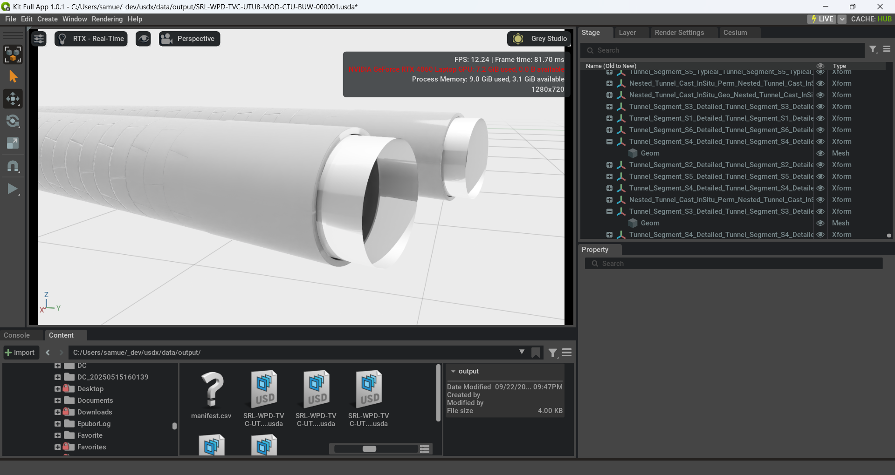

IFC → USD Converter (Federated)

Overview
- Converts IFC files to USD with prototypes, materials, and instances.
- Adds WGS84 geolocation attributes to /World.
- Builds a federated master stage (Federated Model.usda) that payloads each per-file stage under /World/<discipline>.
- Authors IFC properties/quantities as USD attributes under a BIMData namespace.

Requirements
- Python ≥ 3.11
- Shared dependencies (see `pyproject.toml`):
  - `ifcopenshell==0.8.3.post2`
  - `pyproj==3.7.2` (for CRS transforms)
  - `numpy`, `click`, `rich`, etc.
- **Kit mode (default)** – no standalone `usd-core` wheel required. Install Omniverse Kit (``pip install --extra-index-url https://pypi.nvidia.com omniverse-kit``) so `omni.client` and Kit's pxr are available.
- **Offline mode (`--offline`)** – install a standalone USD build (e.g. ``pip install usd-core``). All paths must be local; `omniverse://` URIs are rejected and checkpointing is skipped.

Environment
- Windows requires the Microsoft Visual C++ 2015–2022 Redistributable x64.
- Ensure your virtual environment is active before running.

Install
- Create/activate venv and install dependencies per your workflow (e.g., ``pip install -e .`` or ``uv sync``).
- **Kit mode**
  - Accept the Kit EULA once (PowerShell ``set OMNI_KIT_ACCEPT_EULA=yes``, bash ``export OMNI_KIT_ACCEPT_EULA=yes``).
  - Install Kit: ``pip install --extra-index-url https://pypi.nvidia.com omniverse-kit``.
  - Optional: ``python -c "from omni.kit_app import KitApp; KitApp().shutdown(); print('Omniverse ready')"`` to verify the runtime.
  - The converter auto-starts a headless Kit session whenever an `omniverse://` path is encountered.
- **Offline mode**
  - Install ``usd-core`` (or another pxr build) alongside ifcopenshell.
- Run ``python -m ifc_converter ...`` from the repo root, or ``pip install -e .`` for a global CLI.
- INFO logs show which directory or Nucleus path is scanned and each IFC file as it starts processing (`PYTHONUNBUFFERED=1` for unbuffered output).

Mode selection & environment variables
- The converter can author USD via two bindings:
  - **Kit mode** (default). Used whenever any supplied path is `omniverse://` _or_ when `IFC_CONVERTER_DEFAULT_USD_MODE` resolves to `kit`. Requires Omniverse Kit (`omni.client`), automatically boots Kit in headless mode, and enables Nucleus features such as checkpoints.
  - **Offline mode**. Activated by providing `--offline` on the CLI, `offline=True` in the Python API, or setting `IFC_CONVERTER_DEFAULT_USD_MODE=offline`. All paths must be local filesystem locations. Nucleus checkpoint requests are ignored and `omniverse://` inputs raise a `ValueError`.
- Mode-precedence rules:
  1. Explicit CLI/programmatic `offline=True` wins.
  2. Otherwise, if any input/output/manifest path starts with `omniverse://`, Kit mode is chosen.
  3. Otherwise, the environment variable `IFC_CONVERTER_DEFAULT_USD_MODE` (`kit` by default) decides the binding.
- Exclusion handling honours the mode: `--exclude` takes bare stems or names with `.ifc` and skips them case-insensitively during directory scans (local paths or Nucleus directories).
- Relevant environment variables:
  - `IFC_CONVERTER_DEFAULT_USD_MODE` – `kit` (default) or `offline`; establishes the initial USD binding when the process starts.
  - `OMNI_KIT_ACCEPT_EULA` – set to `yes` to suppress Kit's interactive EULA prompt during headless launches.
  - `PYTHONUNBUFFERED` – optional; keep at `1` to stream logs without buffering during long conversions.
  - `USD_FORCE_MODULE_NAME` – honoured by pxr when present; useful if your USD distribution installs under a different module alias.

Usage (CLI)
- Single IFC file:
  - python -m ifc_converter --input C:\\path\\to\\file.ifc
- Directory, specific names:
  - python -m ifc_converter --input C:\\path\\to\\dir --ifc-names A.ifc B.ifc
- Directory, all files:
  - python -m ifc_converter --input C:\\path\\to\\dir --all
- Offline conversion (local-only, no Kit):
  - python -m ifc_converter --offline --input C:\\path\\to\\dir --all
- Directory, all files excluding drafts:
  - python -m ifc_converter --input C:\\path\\to\\dir --all --exclude DraftModel TempIFC
- Checkpoint authored layers on Nucleus:
  - python -m ifc_converter --input omniverse://server/Projects/IFC --all --checkpoint
- Custom CRS (default EPSG:7855):
  - python -m ifc_converter --input C:\\path\\to\\dir --all --map-coordinate-system EPSG:XXXX
- Manifest-driven base points / federated routing:
  - python -m ifc_converter --input C:\\path\\to\\dir --all --manifest src/ifc_converter/config/sample_manifest.json
- Nucleus (omniverse://) paths work for files or directories:
  - python -m ifc_converter --input omniverse://server/Projects/IFC --all

Usage (VS Code)
- Press F5 and pick one of the provided launch configurations in .vscode/launch.json.
- Modify args there to suit your inputs.

Usage (Python)
- from ifc_converter import convert
- results = convert("path/to/file.ifc", output_dir="data/output")  # returns List[ConversionResult]
- convert("omniverse://server/Projects/file.ifc", output_dir="omniverse://server/USD/output")
- convert("path/to/file.ifc", output_dir="data/output", checkpoint=True)  # omniverse:// required for checkpoints

Outputs
- Per-IFC stages and layers are written to data/output:
  - <name>.usda (stage)
  - prototypes/<name>_prototypes.usda
  - materials/<name>_materials.usda
  - instances/<name>_instances.usda
  - geometry2d/<name>_geometry2d.usda (when present; captured 2D alignment/annotation curves)
    - /World/<file>_Instances preserves the IFC spatial hierarchy (Project/Site/Storey/Class).
    - Optional grouping variants (see src/ifc_converter/process_usd.py:author_instance_grouping_variant) can reorganize instances on demand without losing the canonical hierarchy.
  - caches/<name>.json stores serialized instance metadata for later regrouping sessions.
- Federated master stage:
  - Federated Model.usda: contains a /World default prim.
  - Each IFC adds a child prim /World/<name> with an inactive payload to that file’s default prim.

Units and Geospatial
- Per-file stages author metersPerUnit as needed; WGS84 (lon/lat/height) are authored on /World as Double attributes:
  - cesium:georeferenceOrigin:longitude, cesium:georeferenceOrigin:latitude, cesium:georeferenceOrigin:height
- Federated Model.usda is authored with metersPerUnit=1.0 (meters). Payloads are not rescaled; a log line indicates alignment or mismatch.

IFC Metadata as USD Attributes
- IFC psets/qtos are authored as attributes (not customData) using:
  - BIMData:Psets:<PsetName>:<PropName>
  - BIMData:QTO:<QtoName>:<PropName>
- Types are inferred (Bool/Int/Double and arrays; fallback String).

Federated Stage Behavior
- Each converted USD stage is added as a payload under /World/<file_stem> in Federated Model.usda.
- Payload prims are authored inactive (unloaded by default). Activate to load content.
- Targets the payload stage’s default prim to avoid /World nesting when possible.

Programmatic Use
- main(argv=None) and parse_args(argv=None) accept a list of tokens to drive from scripts/notebooks.
Manifest Schema
- defaults: Global fallback for master name, projected/geodetic CRS, base point, and optional `file_revision` used for checkpoint notes/tags.
- masters: Named federated stages with optional CRS/base point overrides and `file_revision`.
- files: Match rules (name or glob pattern) that choose a master, override CRS/base point/lonlat, and provide a per-file `file_revision`.

Notes
- JSON manifests work immediately; YAML manifests require installing PyYAML.
- A sample manifest template lives at src/ifc_converter/config/sample_manifest.json; copy or rename it locally (e.g. to src/ifc_converter/config/manifest.yaml) when preparing project-specific settings. The real manifest remains untracked by design and can be loaded from local paths or omniverse:// URIs.
- 2D annotation contexts (e.g. alignment strings in IfcAnnotation) are preserved. If the ifcopenshell geometry iterator rejects an annotation context, the pipeline emits a warning and falls back to manual curve extraction so the data still lands in the 2D geometry layer.

Troubleshooting
- pxr ImportError with _tf/_usd DLLs on Windows: install latest VC++ redistributable x64.
- CRS conversions require pyproj; if missing, WGS84 attributes won’t be authored.

Examples
- NVIDIA CAD Converter export of the same tunnel segment shows gaps and lost detail when tessellating the IFC input.

- Our IFC pipeline preserves full segment detail and materials while authoring clean instance hierarchies.

