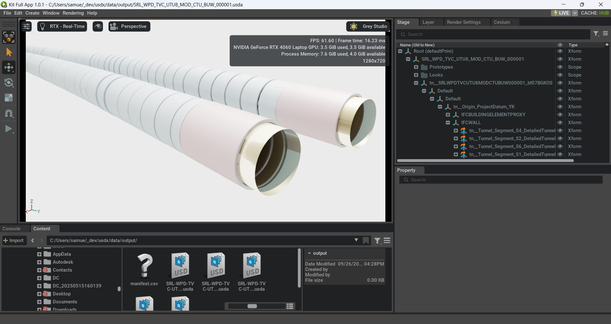

IFC → USD Converter (Federated)

Overview
- Converts IFC files to USD with prototypes, materials, and instances.
- Adds WGS84 geolocation attributes to /World.
- Provides a separate federation CLI (`python -m buildusd.federate`) that assembles per-file stages into project master files without touching conversion outputs.
- Authors IFC properties/quantities as USD attributes under a BIMData namespace.

Requirements
- Python ≥ 3.11
- Shared dependencies (see `pyproject.toml`):
  - `ifcopenshell==0.8.3.post2`
  - `pyproj==3.7.2` (for CRS transforms)
  - `numpy`, `click`, `rich`, etc.
- **Kit mode (default)** – no standalone `usd-core` wheel required. Install Omniverse Kit (``pip install --extra-index-url https://pypi.nvidia.com omniverse-kit``) so `omni.client` and Kit's pxr are available.
- **Offline mode (`--offline`)** – install a standalone USD build (e.g. ``pip install usd-core``). All paths must be local; `omniverse://` URIs are rejected and checkpointing is skipped.

Environment
- Windows requires the Microsoft Visual C++ 2015–2022 Redistributable x64.
- Ensure your virtual environment is active before running.

Install
- Create/activate venv and install dependencies per your workflow (e.g., ``pip install -e .`` or ``uv sync``).
- **Kit mode**
  - Accept the Kit EULA once (PowerShell ``set OMNI_KIT_ACCEPT_EULA=yes``, bash ``export OMNI_KIT_ACCEPT_EULA=yes``).
  - Install Kit: ``pip install --extra-index-url https://pypi.nvidia.com omniverse-kit``.
  - Optional: ``python -c "from omni.kit_app import KitApp; KitApp().shutdown(); print('Omniverse ready')"`` to verify the runtime.
  - The converter auto-starts a headless Kit session whenever an `omniverse://` path is encountered.
- **Offline mode**
  - Install ``usd-core`` (or another pxr build) alongside ifcopenshell.
- Run ``python -m buildusd ...`` from the repo root, or ``pip install -e .`` for a global CLI.
- Legacy invocations like ``python -m ifc_converter`` continue to work via a compatibility shim.
- INFO logs show which directory or Nucleus path is scanned and each IFC file as it starts processing (`PYTHONUNBUFFERED=1` for unbuffered output).

Mode selection & environment variables
- The converter can author USD via two bindings:
  - **Kit mode** (default). Used whenever any supplied path is `omniverse://` _or_ when `BUILDUSD_DEFAULT_USD_MODE` (legacy `IFC_CONVERTER_DEFAULT_USD_MODE`) resolves to `kit`. Requires Omniverse Kit (`omni.client`), automatically boots Kit in headless mode, and enables Nucleus features such as checkpoints.
  - **Offline mode**. Activated by providing `--offline` on the CLI, `offline=True` in the Python API, or setting `BUILDUSD_DEFAULT_USD_MODE=offline` (legacy `IFC_CONVERTER_DEFAULT_USD_MODE=offline`). All paths must be local filesystem locations. Nucleus checkpoint requests are ignored and `omniverse://` inputs raise a `ValueError`.
- Mode-precedence rules:
  1. Explicit CLI/programmatic `offline=True` wins.
  2. Otherwise, if any input/output/manifest path starts with `omniverse://`, Kit mode is chosen.
  3. Otherwise, the environment variable `BUILDUSD_DEFAULT_USD_MODE` (`kit` by default, falls back to `IFC_CONVERTER_DEFAULT_USD_MODE`) decides the binding.
- Exclusion handling honours the mode: `--exclude` takes bare stems or names with `.ifc` and skips them case-insensitively during directory scans (local paths or Nucleus directories).
- Relevant environment variables:
  - `BUILDUSD_DEFAULT_USD_MODE` / `IFC_CONVERTER_DEFAULT_USD_MODE` - `kit` (default) or `offline`; establishes the initial USD binding when the process starts.
  - `OMNI_KIT_ACCEPT_EULA` – set to `yes` to suppress Kit's interactive EULA prompt during headless launches.
  - `PYTHONUNBUFFERED` – optional; keep at `1` to stream logs without buffering during long conversions.
  - `USD_FORCE_MODULE_NAME` – honoured by pxr when present; useful if your USD distribution installs under a different module alias.

Usage (CLI)
- Single IFC file:
  - python -m buildusd --input C:\\path\\to\\file.ifc
- Directory, specific names:
  - python -m buildusd --input C:\\path\\to\\dir --ifc-names A.ifc B.ifc
- Directory, all files:
  - python -m buildusd --input C:\\path\\to\\dir --all
- Offline conversion (local-only, no Kit):
  - python -m buildusd --offline --input C:\\path\\to\\dir --all
- Directory, all files excluding drafts:
  - python -m buildusd --input C:\\path\\to\\dir --all --exclude DraftModel TempIFC
- Checkpoint authored layers on Nucleus:
  - python -m buildusd --input omniverse://server/Projects/IFC --all --checkpoint
- Custom CRS (default EPSG:7855):
  - python -m buildusd --input C:\\path\\to\\dir --all --map-coordinate-system EPSG:XXXX
- Manifest-driven base points / federated routing:
  - python -m buildusd --input C:\\path\\to\\dir --all --manifest src/buildusd/config/sample_manifest.json
  - python -m buildusd --input C:\\path\\to\\dir --all --manifest src/buildusd/config/sample_manifest.yaml
- Assemble masters after conversion:
  - python -m buildusd.federate --stage-root data/output --manifest src/buildusd/config/sample_manifest.json
  - python -m buildusd.federate --stage-root data/output --manifest src/buildusd/config/sample_manifest.yaml --masters-root data/federated
- Nucleus (omniverse://) paths work for files or directories:
  - python -m buildusd --input omniverse://server/Projects/IFC --all
- Update meters-per-unit metadata on an existing USD stage/layer (no IFC conversion):
  - python -m buildusd --set-stage-unit "omniverse://server/Projects/file.usdc" --stage-unit-value 0.001
- Update up-axis metadata on an existing USD stage/layer (no IFC conversion):
  - python -m buildusd --set-stage-up-axis "omniverse://server/Projects/file.usdc" --stage-up-axis Z
- Annotation curve widths:
  - python -m buildusd --input C:\\path\\to\\dir --annotation-width-default 15mm
  - python -m buildusd --input C:\\path\\to\\dir --annotation-width-rule width=0.02,layer=Survey*,curve=*Centerline*
  - python -m buildusd --input C:\\path\\to\\dir --annotation-width-config src/buildusd/config/sample_annotation_widths.json
  - python -m buildusd --input C:\\path\\to\\dir --annotation-width-config src/buildusd/config/sample_annotation_widths.yaml

Model offsets & anchoring
- Stages stay in meters (metersPerUnit=1.0).
- Iterator tessellation runs with use-world-coords=False; placements come from the iterator transform.
- Per file we resolve a model offset from --anchor-mode: local -> Project/Base Point, site -> shared site point; converted to meters with basic unit scaling (m/mm/cm/dm).
- The GeometrySettingsManager applies offset-type (default negative) to the raw offset and pushes the signed value into all ifcopenshell settings objects.
- Each IFC file gets its own resolved offset; offsets are not shared across files.

Usage (VS Code)
- Press F5 and pick one of the provided launch configurations in .vscode/launch.json.
- Modify args there to suit your inputs.

Usage (Python)
- from buildusd import convert
- results = convert("path/to/file.ifc", output_dir="data/output")  # returns List[ConversionResult]
- convert("omniverse://server/Projects/file.ifc", output_dir="omniverse://server/USD/output")
- convert("path/to/file.ifc", output_dir="data/output", checkpoint=True)  # omniverse:// required for checkpoints
- from buildusd.api import set_stage_unit
- set_stage_unit("omniverse://server/Projects/file.usdc", meters_per_unit=0.001)
- from buildusd.api import set_stage_up_axis
- set_stage_up_axis("omniverse://server/Projects/file.usdc", axis="Z")

Outputs
- Per-IFC stages and layers are written to data/output:
  - <name>.usda (stage)
  - prototypes/<name>_prototypes.usda
  - materials/<name>_materials.usda
  - instances/<name>_instances.usda
  - geometry2d/<name>_geometry2d.usda (when present; captured 2D alignment/annotation curves)
    - /World/<file>_Instances preserves the IFC spatial hierarchy (Project/Site/Storey/Class).
    - Optional grouping variants (see src/buildusd/process_usd.py:author_instance_grouping_variant) can reorganize instances on demand without losing the canonical hierarchy.
  - caches/<name>.json stores serialized instance metadata for later regrouping sessions.
- Optional federated masters (run `python -m buildusd.federate --manifest ...` after conversion):
  - Creates master stage(s) defined in the manifest without overwriting per-file outputs.
  - Each converted stage is referenced beneath `/World/<stage_name>` (inactive by default) so you can compose projects on demand.

Materials
- IFC render precedence respected: geometry `IfcStyledItem` styles first, then material presentation (`IfcMaterialDefinitionRepresentation`), then shape aspects, then type. When no MDR is present, we also try `ifcopenshell.util.representation.get_material_style` for the associated material.
- `IfcSurfaceStyleRendering` maps to PreviewSurface: baseColor from SurfaceColour (else DiffuseColour), opacity from Transparency, roughness from SpecularRoughness/specular level, metallic from ReflectanceMethod, emissive from EmissiveColour/SelfLuminous. SurfaceStyleWithTextures/ImageTexture set the baseColor texture when present; UVs from IfcIndexedPolygonalTextureMap are authored as `primvars:st`.
- Names drop literal “Undefined” and add a closest CSS color hint when available (`webcolors` preferred; small fallback palette otherwise).
- Multiple materials → face subsets; iterator materials are not force-overridden beyond IFC precedence. Single-material meshes bind the resolved style when only one material id exists and no face-level subsets are defined.

Detail / remesh
- `enable_high_detail_remesh` defaults to False; the iterator mesh is the base geometry. `--detail-mode`/`detail_scope` runs the OCC detail pipeline without remeshing unless remesh is explicitly enabled.
- OCC detail meshes author under `/World/__PrototypesDetail` (and instance overrides when scoped); the base iterator tessellation remains the primary geometry path.

Annotation Curve Width Overrides
- Control the `UsdGeom.BasisCurves` widths authored in geometry2d layers via `--annotation-width-default`, repeated `--annotation-width-rule`, or config files supplied with `--annotation-width-config`.
- Widths accept numeric values in stage units (`0.015`) or include a unit suffix (`12mm`, `1.5cm`, `0.01m`). A separate `unit` key is also accepted in configuration mappings.
- Rule filters support `layer` (matches the IFC stem used for the geometry2d layer), `curve` (annotation name), `hierarchy` (any label or `/`-joined path in the spatial hierarchy), and `step_id`. Glob-style (`fnmatch`) patterns are applied case-insensitively.
- Rules are evaluated in order: configuration files are loaded first, then the CLI default, followed by any CLI rule expressions. Later matches override earlier ones.
- Example JSON configuration (see `src/buildusd/config/sample_annotation_widths.json`):

```json
{
  "default": "0.015",
  "layers": {
    "Survey*": "12mm"
  },
  "curves": {
    "*Control*": "0.02"
  },
  "layer_curves": {
    "Alignment*": {
      "Centerline*": {"width": 18, "unit": "mm"},
      "Offset*": "0.01"
    }
  },
  "hierarchies": {
    "*Level 01*": "0.012"
  }
}
```

- Example YAML configuration (see `src/buildusd/config/sample_annotation_widths.yaml`):

```yaml
default: 0.015

layers:
  "Survey*": 12mm
  "Alignment*":
    width: 18
    unit: mm

curves:
  "*Centerline*": 0.02

layer_curves:
  "Alignment*":
    "Offset*": 0.01

hierarchies:
  "*Level 01*": 0.012
```

Units and Geospatial
- Per-file stages author metersPerUnit as needed; WGS84 (lon/lat/height) are authored on /World as Double attributes:
  - cesium:georeferenceOrigin:longitude, cesium:georeferenceOrigin:latitude, cesium:georeferenceOrigin:height
- Federated masters created via `buildusd.federate` are authored with metersPerUnit=1.0 (meters). Payloads are not rescaled; a log line indicates alignment or mismatch.

Geo Anchoring
- Conversion and federation now expose `--anchor-mode` controlling how /World is aligned. `local` anchors to the per-file base point, `site` aligns to the shared site base point, and `none` leaves /World unchanged (the default).
- The manifest can define `defaults.shared_site_base_point` and per-master/per-file overrides via `shared_site_base_point`. When `--anchor-mode site` is used, resolution falls back through file → master → defaults → repo fallback → (0,0,0).
- When `local` anchoring is requested but a file lacks its own base point, the pipeline automatically falls back to `site` so stages always receive a valid anchor.
- Geodetic metadata is derived from the anchor point (using `pyproj` when available) and written to `/World` alongside the traditional `ifc:` attributes.
- Example invocations: `python -m buildusd --anchor-mode site ...` for conversion, `python -m buildusd --anchor-mode none ...` to leave stages unanchored, and `python -m buildusd.federate --anchor-mode site ...` to keep federated masters aligned in the same frame.

IFC Metadata as USD Attributes
- IFC psets/qtos are authored as attributes (not customData) using:
  - BIMData:Psets:<PsetName>:<PropName>
  - BIMData:QTO:<QtoName>:<PropName>
- Types are inferred (Bool/Int/Double and arrays; fallback String).

Federated Stage Behavior (via `buildusd.federate`)
- Each converted USD stage is referenced as a payload under `/World/<file_stem>` in the manifest-selected master stage.
- Payload prims are authored inactive (unloaded by default). Activate to load content.
- The payload targets the stage's default prim so additional `/World` nesting is avoided when possible.

Programmatic Use
- `from buildusd import api` exposes structured helpers. `api.ConversionSettings` and `api.convert()` mirror the CLI; `api.FederationSettings` and `api.federate_stages()` do the same for master assembly; `api.apply_stage_anchor_transform()` anchors custom USD stages consistently.
- `api.CONVERSION_DEFAULTS` / `api.FEDERATION_DEFAULTS` expose the packaged defaults, and `api.DEFAULT_CONVERSION_OPTIONS` offers a ready-to-clone baseline for geometry harvesting.
- Anchor modes accept `"local"`, `"site"`, or `None`/`"none"`; the latter skips writing a transform on `/World`.
- main(argv=None) and parse_args(argv=None) accept a list of tokens to drive from scripts/notebooks.
Manifest Schema
- defaults: Global fallback for master name, projected/geodetic CRS, base point, and optional `file_revision` used for checkpoint notes/tags.
- masters: Named federated stages with optional CRS/base point overrides and `file_revision`.
- files: Match rules (name or glob pattern) that choose a master, override CRS/base point/lonlat, and provide a per-file `file_revision`.

Notes
- JSON manifests work immediately; YAML manifests require installing PyYAML.
- Sample manifest templates live at:
  - src/buildusd/config/sample_manifest.json (JSON with `_comment` helper fields)
  - src/buildusd/config/sample_manifest.yaml (YAML with inline comments)
  Copy one of them locally (e.g. to src/buildusd/config/manifest.yaml) when preparing project-specific settings. The real manifest remains untracked by design and can be loaded from local paths or omniverse:// URIs.
- 2D annotation contexts (e.g. alignment strings in IfcAnnotation) are preserved. If the ifcopenshell geometry iterator rejects an annotation context, the pipeline emits a warning and falls back to manual curve extraction so the data still lands in the 2D geometry layer.


Troubleshooting
- pxr ImportError with _tf/_usd DLLs on Windows: install latest VC++ redistributable x64.
- CRS conversions require pyproj; if missing, WGS84 attributes won’t be authored.

Examples
- NVIDIA CAD Converter export of the same tunnel segment shows gaps and lost detail when tessellating the IFC input.



- Our IFC pipeline preserves full segment detail and materials while authoring clean instance hierarchies.


